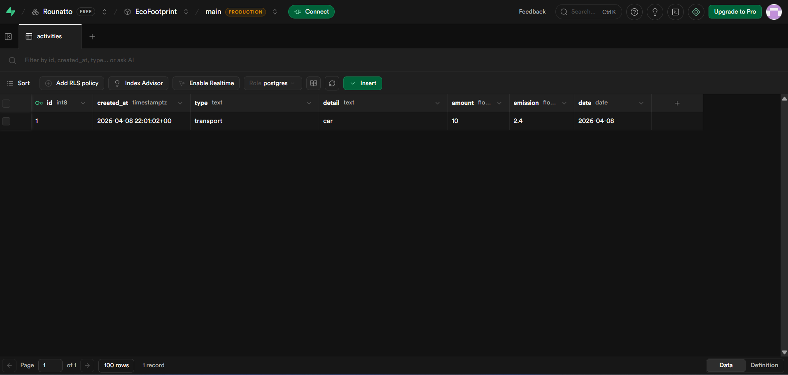
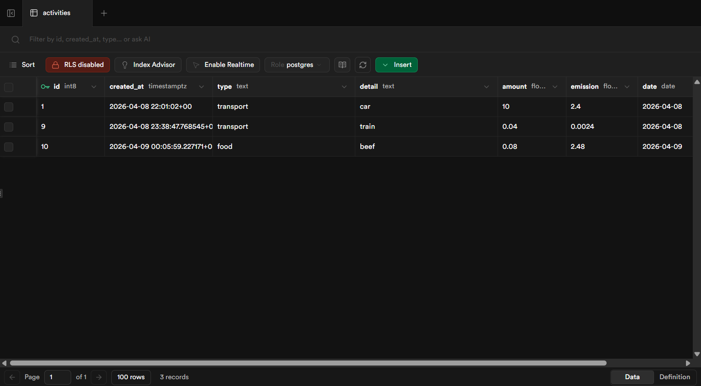

# 🌍 EcoFootprint Full-Stack App

Une application web interactive permettant aux utilisateurs de calculer, suivre et analyser leur empreinte carbone, avec un accent particulier sur les trajets écologiques.

## 🚀 Fonctionnalités Principales
* **Tableau de bord dynamique :** Visualisation des émissions de CO2.
* **Calculateur de trajets :** Comparaison de l'empreinte carbone selon le moyen de transport.
* **Historique et Objectifs :** Sauvegarde des données utilisateurs pour un suivi à long terme.

## 🛠️ Tech Stack
* **Frontend :** HTML5, CSS3 (Variables natives, Flexbox), Vanilla JavaScript, Leaflet.js (Cartographie).
* **Backend :** Python, Flask.
* **Base de Données :** PostgreSQL (hébergé sur Supabase).

## 🔐 Configuration Supabase pour l'ecriture
Pour que les lignes soient vraiment ajoutees dans `activities`, utilise une cle serveur cote backend ou ajoute une policy RLS d'insertion.

### Option recommandee: cle serveur
Dans `.env`, utilise :
```env
SUPABASE_URL=ton_url_supabase
SUPABASE_SERVICE_ROLE_KEY=ta_cle_service_role
```

### Option alternative: garder la cle publique et autoriser l'insertion
Execute ceci dans l'editeur SQL de Supabase :
```sql
alter table public.activities enable row level security;

create policy "allow insert activities"
on public.activities
for insert
to anon, authenticated
with check (true);
```

## 📸 Aperçu du Projet






## 💻 Installation en Local
Pour faire tourner ce projet sur votre machine :

1. Clonez le dépôt :
   \`git clone https://github.com/Rounatto/EcoFootprint-FullStack-App.git\`
2. Installez les dépendances :
   \`pip install -r requirements.txt\`
3. Créez un fichier \`.env\` à la racine avec vos clés Supabase :
   \`SUPABASE_URL=votre_url\`
   \`SUPABASE_SERVICE_ROLE_KEY=votre_cle_service_role\`
4. Lancez le serveur Flask :
   \`python EcoFootprint.py\`