# EcoFootprint Full-Stack App

EcoFootprint est une application web de suivi d'empreinte carbone. Elle centralise la saisie d'activites, le calcul des emissions, le suivi d'objectifs et la visualisation des donnees dans une interface claire, moderne et orientee portfolio.

## Apercu du projet
- Suivi des activites par categorie: transport, energie, alimentation et achats.
- Calcul automatique des emissions de CO2.
- Historique synchronise avec Supabase PostgreSQL.
- Objectifs environnementaux et conseils eco-responsables.
- Carte interactive Leaflet pour visualiser et mesurer des distances.

## Points forts
- Interface unifiee avec dashboard, objectifs, conseils et carte.
- Donnees persistantes via Supabase.
- Navigation simple et claire pour une demo en entretien ou en soutenance.
- Galerie d'ecrans documentaire deja preparee pour le README.

## Tech Stack
- Frontend: HTML5, CSS3, Vanilla JavaScript, Leaflet.js
- Backend: Python, Flask
- Base de donnees: PostgreSQL via Supabase
- UI assets: Font Awesome, Chart.js

## Fonctionnalites principales
### Tableau de bord
- Cartes de synthese pour les emissions globales, l'energie et le transport.
- Graphique des emissions.
- Carte interactive pour visualiser les trajets.

### Gestion des donnees
- Ajout d'activites avec categorie, detail, quantite et date.
- Suppression d'activites.
- Chargement de l'historique depuis la base de donnees.

### Objectifs et conseils
- Creation d'objectifs de reduction.
- Consultation de recommandations ecolos.

## Architecture du projet
- [EcoFootprint.py](EcoFootprint.py): routes Flask et connexion Supabase.
- [templates/index.html](templates/index.html): structure HTML principale.
- [static/EcoFootprint.css](static/EcoFootprint.css): styles de l'application.
- [static/EcoFootprint.js](static/EcoFootprint.js): logique interface, navigation et appels API.

## Configuration Supabase
Pour que les insertions et suppressions fonctionnent vraiment, il faut une configuration d'ecriture valide.

### Option recommandee: cle serveur
Utilise une cle serveur cote backend dans `.env`:

```env
SUPABASE_URL=ton_url_supabase
SUPABASE_SERVICE_ROLE_KEY=ta_cle_service_role
```

### Option alternative: policy RLS
Si tu gardes une cle publique, ajoute une policy d'insertion et de suppression dans Supabase:

```sql
alter table public.activities enable row level security;

create policy "allow insert activities"
on public.activities
for insert
to anon, authenticated
with check (true);

create policy "allow delete activities"
on public.activities
for delete
to anon, authenticated
using (true);
```

## Installation locale
1. Cloner le depot:

```bash
git clone https://github.com/Rounatto/EcoFootprint-FullStack-App.git
```

2. Installer les dependances:

```bash
pip install -r requirements.txt
```

3. Configurer le fichier `.env`:

```env
SUPABASE_URL=votre_url
SUPABASE_SERVICE_ROLE_KEY=votre_cle_service_role
```

4. Lancer l'application:

```bash
python EcoFootprint.py
```

## API backend
- `GET /api/activities`: recuperer l'historique des activites.
- `POST /api/add-activity`: ajouter une activite.
- `DELETE /api/delete-activity/<id>`: supprimer une activite.

## Captures d'ecran

### Dashboard et carte
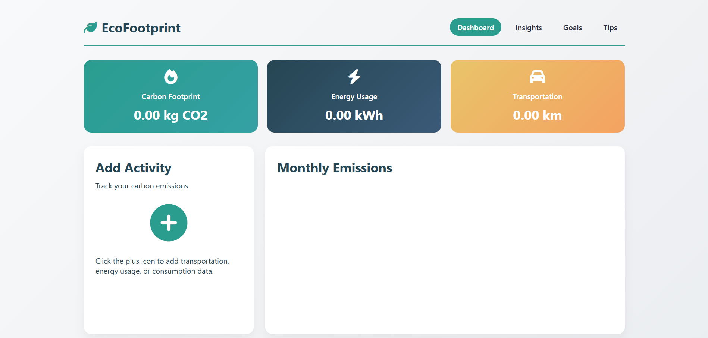
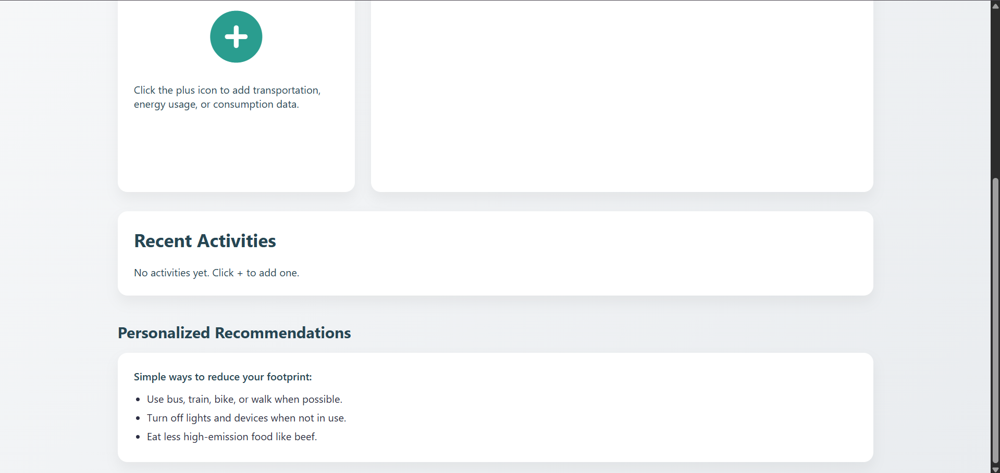
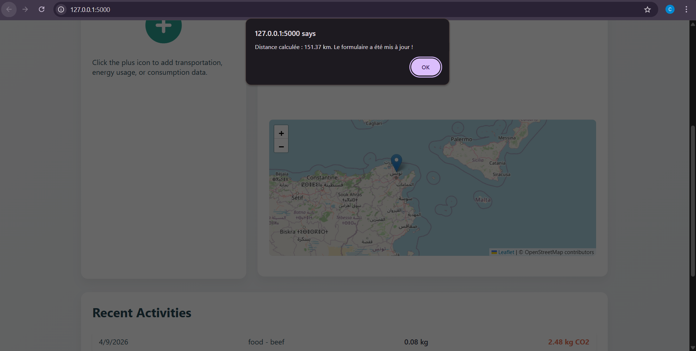
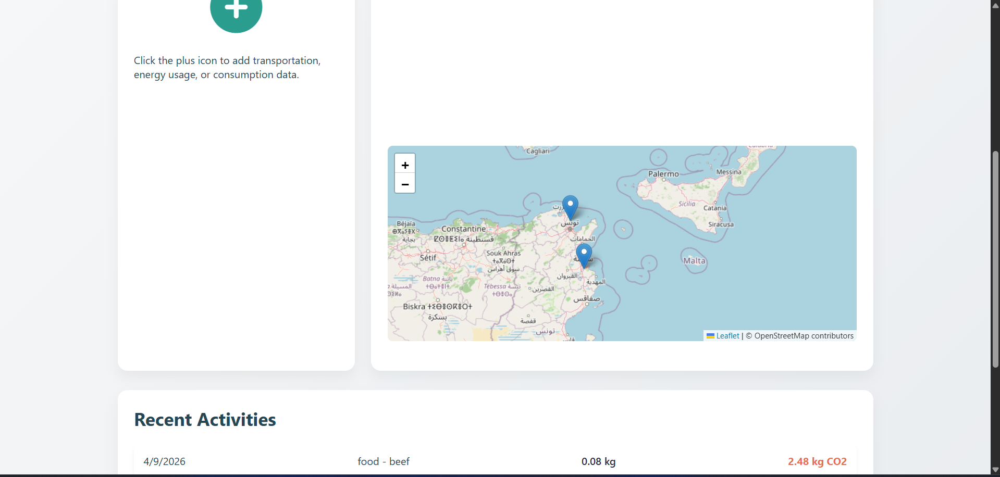

### Historique et emissions
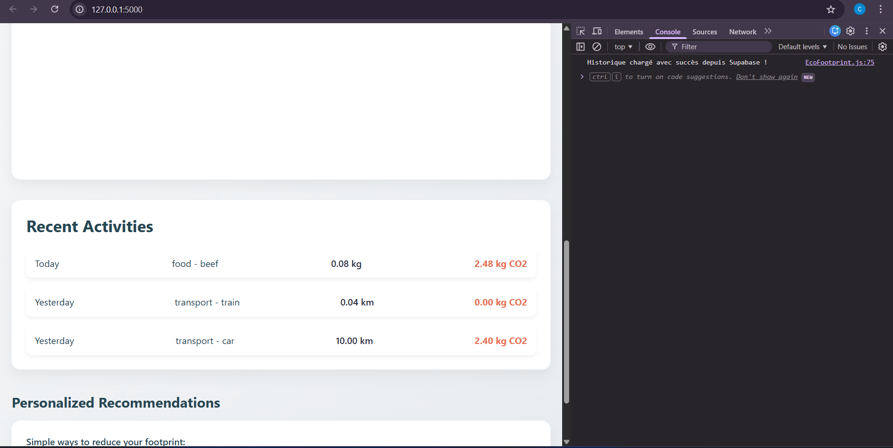
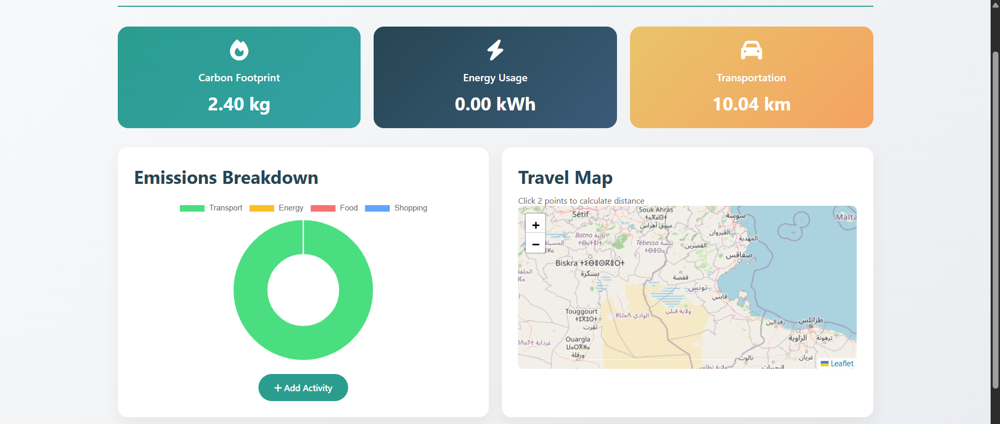
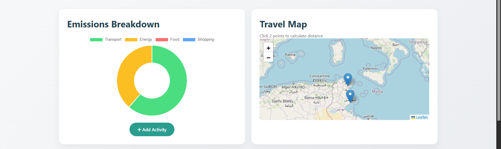
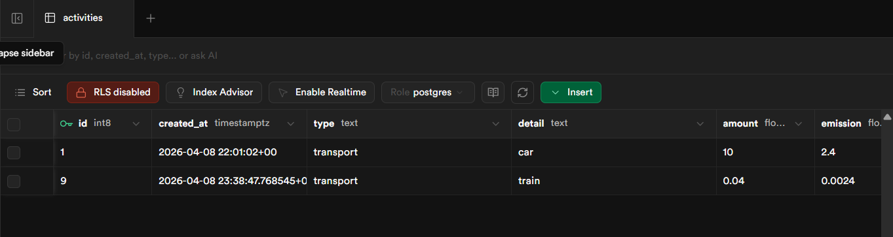

### Suppression d'activite
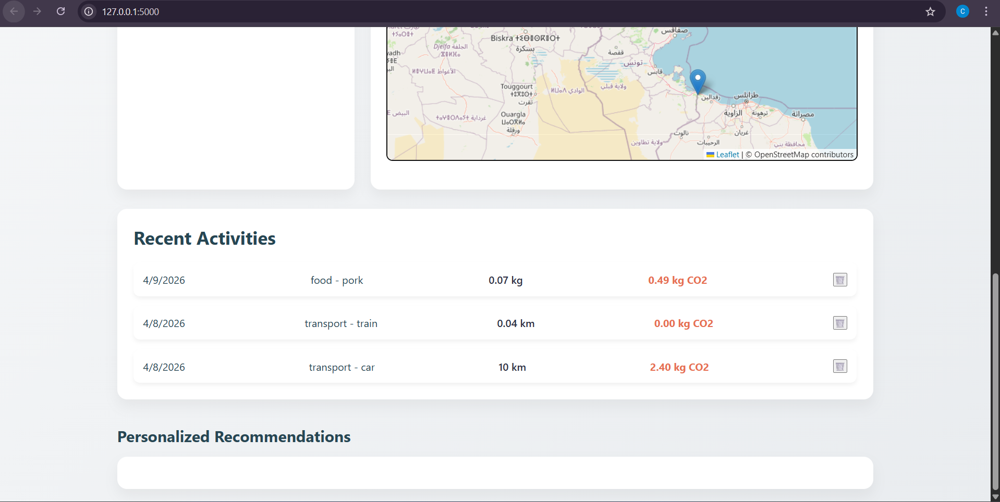
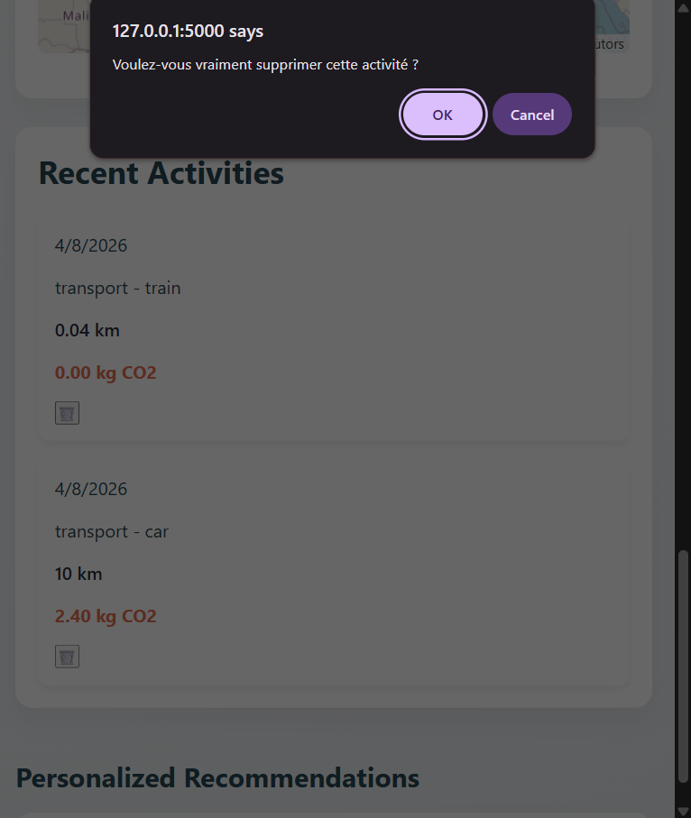
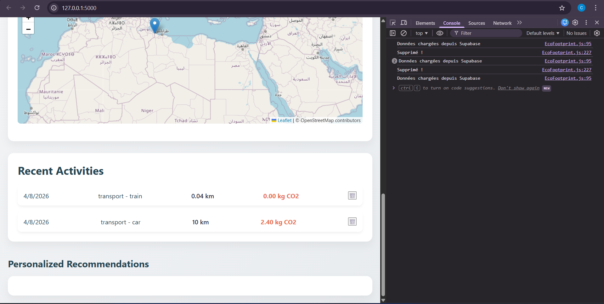
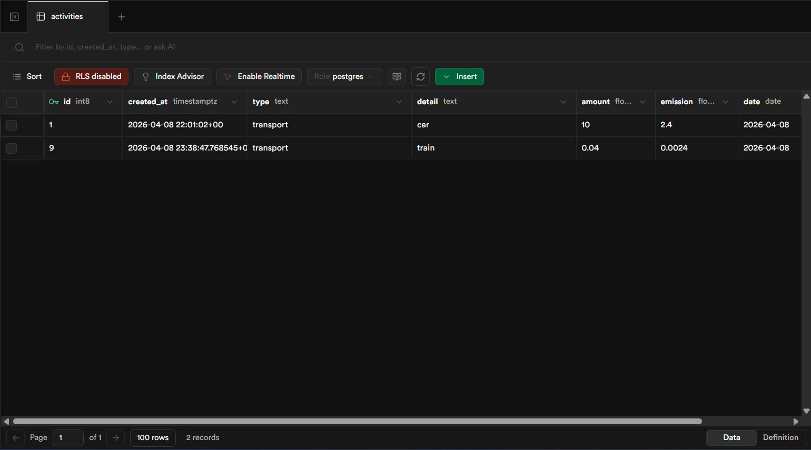

### Objectifs
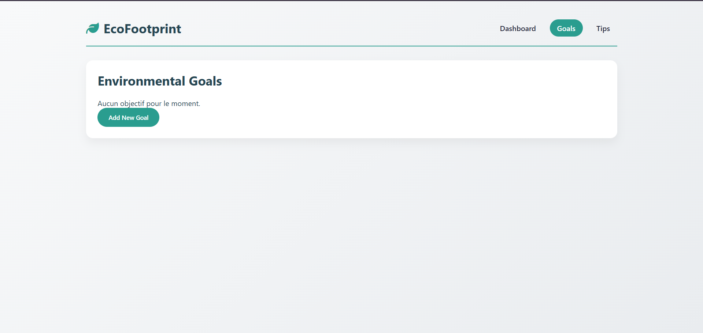
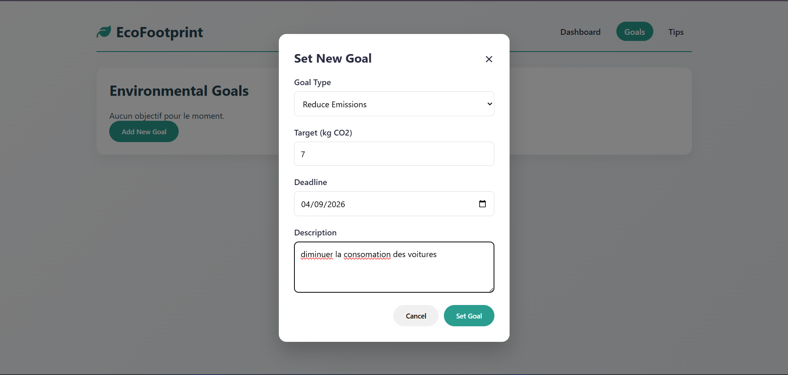
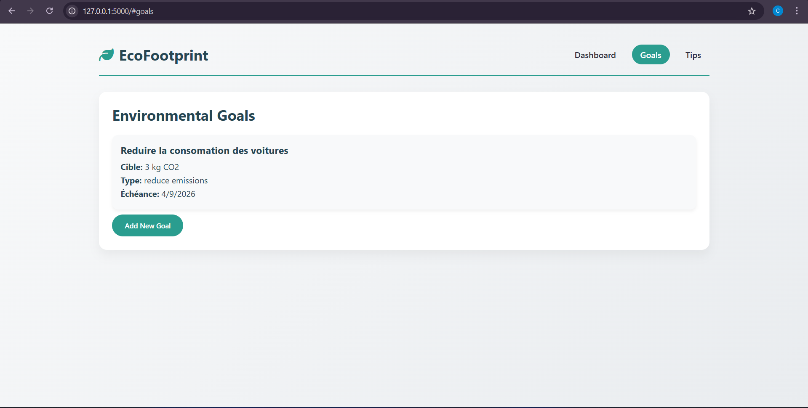
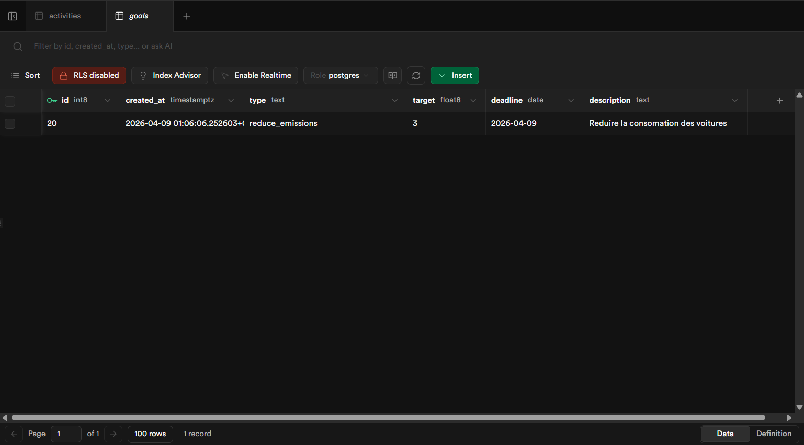
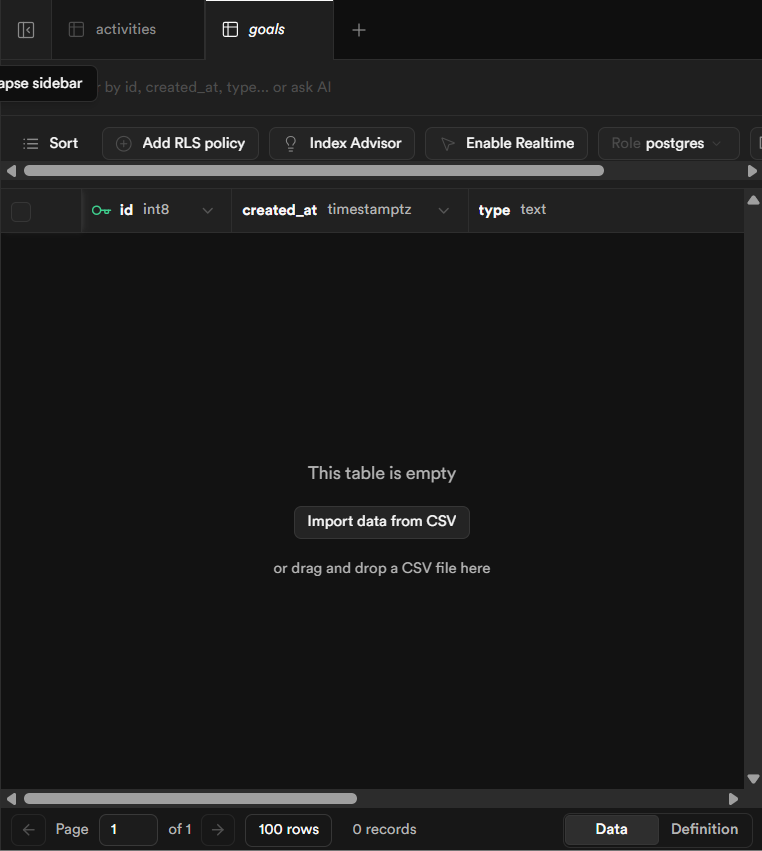
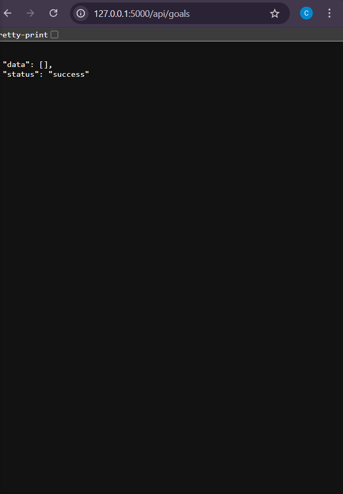

### Rendu final
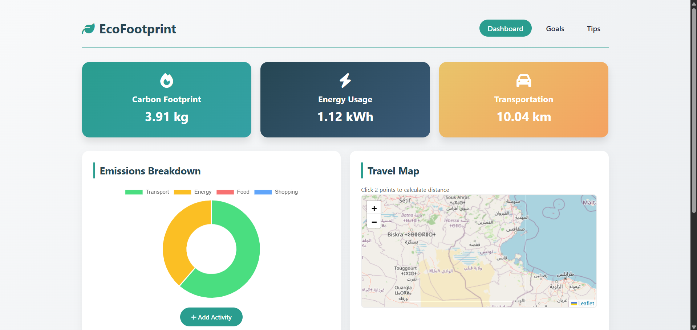
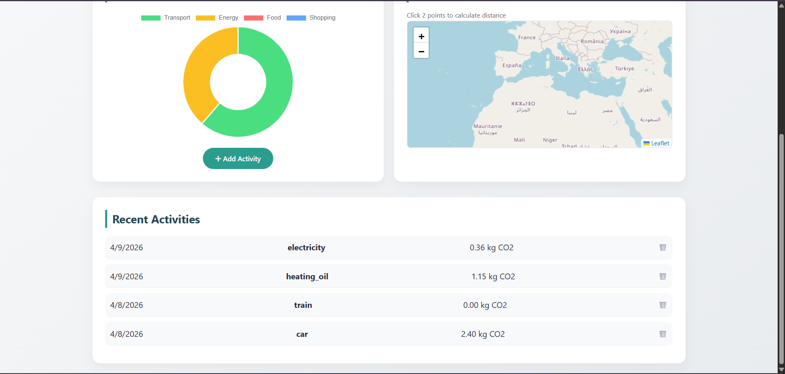

## Notes
- Le fichier `.env` ne doit jamais etre pousse sur GitHub.
- Si tu utilises une cle publique Supabase, assure-toi que les policies RLS autorisent les insertions et suppressions.